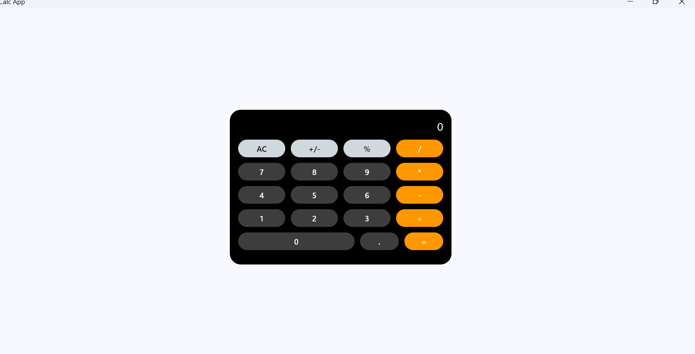
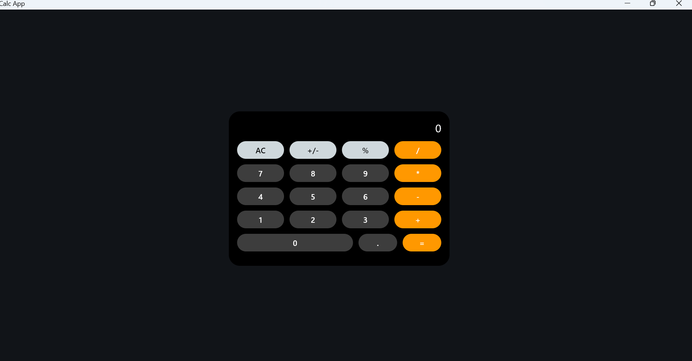

# تطبيق الحاسبة (Flet)

[English](README_en.md) | [Français](README_fr.md)

تطبيق حاسبة عصري وأنيق تم بناؤه باستخدام إطار العمل [Flet](https://flet.dev/) بلغة بايثون.

## المميزات
- **العمليات الحسابية الأساسية**: الجمع، الطرح، الضرب، والقسمة.
- **تصميم متجاوب**: واجهة مستخدم نظيفة بالثيم المظلم.
- **متعدد المنصات**: يمكن تشغيله على ويندوز، لينكس، ماك، ويمكن نشره كتطبيق ويب.

## المتطلبات
- بايثون 3.9 أو أحدث
- مكتبة Flet

## التثبيت
1. قم باستنساخ المستودع:
   ```bash
   git clone https://github.com/hassen-1234/calculatrice_simple.git
   cd calculatrice_simple
   ```
2. تثبيت الحزم المطلوبة:
   ```bash
   pip install flet
   ```

## الاستخدام
قم بتنفيذ:
```bash
flet run
```

## معاينة الشاشة




